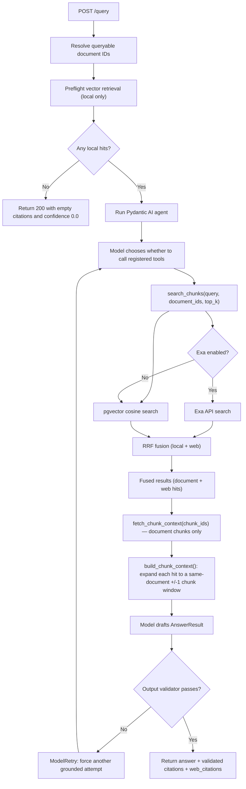

# AskMyDocs

AskMyDocs is a local PDF Q&A backend built with FastAPI, Docling, PostgreSQL + pgvector, Pydantic AI, and Ollama. The current MVP supports upload, ingestion, embedding-backed retrieval, grounded answering, and citation validation.

## What It Does

- Upload a single PDF per request.
- Parse and normalize document structure with Docling.
- Chunk and embed document text into PostgreSQL + pgvector.
- Query ready documents through a Pydantic AI agent using tool calls.
- Optionally augment retrieval with Exa web search (hybrid search).
- Return typed answers with citation objects tied to real stored chunks.
- Report app, database, chat-model, and embedding-model health through `/health`.

## Prerequisites

- Python 3.13+
- `uv`
- Docker with `docker compose`
- Ollama running locally

Required Ollama models:

- Embeddings: `embeddinggemma`
- Chat/tool-calling: the model named by `ANTHROPIC_MODEL_NAME` (defaults to `kimi-k2.5:cloud`)

## Bootstrap

Fastest local setup:

```bash
./scripts/bootstrap.sh
```

The bootstrap script:

- checks that `uv`, Docker, and `docker compose` are available
- creates `.env` from `.env.example` when needed
- installs dependencies with `uv sync --extra dev`
- starts PostgreSQL with pgvector through Docker Compose
- applies the raw SQL migrations

Manual setup is equivalent:

```bash
cp .env.example .env
uv sync --extra dev
docker compose up -d postgres
uv run python scripts/migrate.py
```

## Environment

Both chat and embedding endpoints default to the same local Ollama host:

- `ANTHROPIC_BASE_URL=http://localhost:11434`
- `OLLAMA_BASE_URL=http://localhost:11434`

They target different endpoint families:

- `ANTHROPIC_BASE_URL` is for Ollama's Anthropic-compatible chat/tool-calling API
- `OLLAMA_BASE_URL` is for Ollama native endpoints such as `/api/embed` and `/api/tags`

## Langfuse Tracing

AskMyDocs now emits Langfuse traces for:

- FastAPI requests
- document uploads
- ingestion jobs
- Ollama embedding calls
- vector retrieval
- Pydantic AI agent runs and tool calls

Set these environment variables to enable tracing:

```env
LANGFUSE_PUBLIC_KEY=pk-lf-...
LANGFUSE_SECRET_KEY=sk-lf-...
LANGFUSE_HOST=https://us.cloud.langfuse.com
LANGFUSE_TRACING_ENABLED=true
LANGFUSE_TRACING_ENVIRONMENT=development
LANGFUSE_SAMPLE_RATE=1.0
LANGFUSE_RELEASE=
```

Tracing currently sends content-rich traces:

- Pydantic AI content capture is enabled, so prompts, completions, retrieved chunk text, and tool payload bodies are visible in Langfuse.
- Request and service spans still record operational metadata such as filenames, document IDs, counts, status codes, and confidence.
- Uploaded file bytes are still masked before export.

Optional headers:

- `X-Session-ID`: attaches a `session_id` to the trace for conversation or workflow grouping
- `X-User-ID`: attaches a `user_id` to the trace for per-user filtering

Test runs do not initialize Langfuse, which keeps `pytest` quiet and avoids exporting local test traffic.

## Logfire Logging

AskMyDocs also sends observability data to Logfire for:

- standard-library logging via the official [`LogfireLoggingHandler`](https://logfire.pydantic.dev/docs/integrations/logging/)
- FastAPI request instrumentation
- Pydantic AI agent instrumentation

Set these environment variables to enable log shipping:

```env
LOGFIRE_TOKEN=
LOGFIRE_SEND_TO_LOGFIRE=true
LOGFIRE_SERVICE_NAME=askmydocs
LOGFIRE_SERVICE_VERSION=
LOGFIRE_ENVIRONMENT=development
```

Behavior notes:

- Existing stdout logs stay enabled with the current key/value formatter.
- Logfire export is only enabled when `LOGFIRE_TOKEN` is set.
- `LOGFIRE_ENVIRONMENT` falls back to `APP_ENV` when omitted.
- The app disables Logfire's own console output so local logs are not duplicated.
- FastAPI instrumentation also records request-level attributes and attaches `X-Session-ID` and `X-User-ID` when present.
- Langfuse tracing remains enabled independently; both systems run side by side when configured.
- Pytest runs do not initialize Logfire exports, which avoids sending local test traffic to the dashboard.

## Hybrid Search (Exa)

AskMyDocs can optionally augment local pgvector retrieval with [Exa](https://exa.ai) web search. When enabled, each query runs both a local embedding search and an Exa API search, then merges results using Reciprocal Rank Fusion (RRF).

### How it works

1. pgvector cosine search runs against local document chunks (always).
2. Exa API search runs in parallel (when enabled).
3. Results are fused with weighted RRF — local results are favored by default.
4. The agent sees both local chunk references and web results with `source` markers.
5. Document citations go into `citations`; web citations go into `web_citations`.

### Configuration

Set these environment variables to enable hybrid search:

```env
EXA_API_KEY=your-exa-api-key
EXA_ENABLED=true
EXA_SEARCH_TYPE=auto       # "auto" | "neural" | "keyword"
EXA_NUM_RESULTS=5
EXA_WEIGHT=0.5             # RRF weight for Exa results (0.0-1.0)
```

Notes:

- Exa is **disabled by default** (`EXA_ENABLED=false`). The system works identically to before without it.
- `EXA_WEIGHT=0.5` means local results are weighted 2× relative to Exa results.
- If Exa is unreachable, the system falls back silently to local-only results.
- Cost estimate per query with 5 Exa results: ~$0.017 USD.

### Updated query response

When Exa is enabled, the `/query` response may include a `web_citations` field:

```json
{
  "answer": "...",
  "citations": [
    {"document_id": 1, "chunk_id": 14, "filename": "paper.pdf", "quote": "..."}
  ],
  "web_citations": [
    {"url": "https://example.com/article", "title": "Relevant Article", "quote": "..."}
  ],
  "confidence": 0.83
}
```

`web_citations` defaults to an empty list when Exa is disabled or no web results are relevant.

### Design note: pre-flight retrieval is local only

The `/query` endpoint runs a pre-flight retrieval check using local pgvector search before starting the agent. If this local pre-flight returns no hits, the query short-circuits with a "no relevant information" response and the agent never runs — meaning Exa is never called.

This is intentional:

- The pre-flight acts as a gate on whether the uploaded documents contain any relevant content. If local documents have nothing, adding web context would violate the document-grounded design.
- Exa results cannot be pre-seeded into agent deps the same way local chunk context can, because web citations don't go through `fetch_chunk_context`.
- Keeping the pre-flight local-only avoids unnecessary Exa API calls (and cost) when the user's documents clearly don't cover the topic.

Hybrid search (pgvector + Exa) runs inside the agent's `search_chunks` tool call, which only executes after the pre-flight confirms local hits exist.

## Run The API

Start the server:

```bash
uv run uvicorn app.main:app --reload --host 0.0.0.0 --port 8000
```

Check health:

```bash
curl http://127.0.0.1:8000/health
```

Expected healthy response:

```json
{
  "status": "ok",
  "checks": {
    "app": {"status": "ok", "detail": null},
    "db": {"status": "ok", "detail": null},
    "anthropic_compat": {"status": "ok", "detail": null},
    "ollama_native": {"status": "ok", "detail": null}
  }
}
```

If PostgreSQL is down, the configured embed model is missing, or the configured chat model is unavailable, `/health` returns `503` with a short sanitized detail per failing component.

## End-To-End Flow

### 1. Upload

```bash
curl -X POST http://127.0.0.1:8000/documents/upload \
  -F "file=@/absolute/path/to/paper.pdf;type=application/pdf"
```

Useful notes:

- Uploads are idempotent by checksum.
- Stored files use `UPLOAD_DIR/<sha256>.pdf`.
- The original filename is preserved in the database and API responses.

List documents:

```bash
curl http://127.0.0.1:8000/documents
```

Get document detail:

```bash
curl http://127.0.0.1:8000/documents/1
```

### 2. Ingest

```bash
curl -X POST http://127.0.0.1:8000/documents/1/ingest
```

The route returns `202 Accepted` with an ingestion job. Poll document detail to track progress:

- `document.status`: `uploaded` -> `ingesting` -> `ready` or `failed`
- `latest_ingestion.status`: `pending` -> `running` -> `completed` or `failed`
- `chunk_count`: non-zero once chunks and embeddings are stored

Successful ingest also writes a normalized parsed artifact to:

```text
PARSED_DIR/<document_id>.json
```

### 3. Query

```bash
curl -X POST http://127.0.0.1:8000/query \
  -H "Content-Type: application/json" \
  -d '{
    "question": "What should the agent avoid fabricating?",
    "document_ids": [1],
    "top_k": 5
  }'
```

Behavior notes:

- Missing requested document IDs return `404`.
- Requested documents that are not `ready` return `409`.
- Retrieval no-hit responses return a normal `200` with empty citations and `confidence: 0.0`.
- Dependency failures during live retrieval return sanitized `5xx` responses instead of raw stack traces.

### Query Lifecycle

The `/query` path has a deliberate two-stage retrieval flow:

1. The service resolves the allowed ready documents.
2. It runs a local-only retrieval preflight (pgvector cosine search).
3. If retrieval returns no local hits, the API skips the LLM and returns the fixed no-hit response.
4. If retrieval finds hits, the Pydantic AI agent runs and the model may call tools such as `search_chunks` and `fetch_chunk_context`.
5. Inside `search_chunks`, hybrid search runs pgvector + optional Exa API search with RRF fusion.
6. Final document citations are validated against fetched chunk context, and web citations are validated against retrieved Exa URLs.



Notes:

- Tool availability is defined in `app/agent/tools.py`, but tool selection during the agent run is done by the model.
- `fetch_chunk_context` is constrained to chunks from the current search scope.
- Context expansion is local adjacency expansion, not reranking or summarization.

## Helper Scripts

### Demo ingest script

Upload, ingest, poll, and optionally query in one step:

```bash
uv run python scripts/ingest_sample.py /absolute/path/to/paper.pdf
uv run python scripts/ingest_sample.py /absolute/path/to/paper.pdf \
  --question "What are the main findings?"
```

The script exits non-zero if the PDF is missing or if ingestion finishes in a failed state.

### Reset local data

Reset the app tables:

```bash
uv run python scripts/reset_db.py --yes
```

Reset the app tables and remove upload/parsed artifacts:

```bash
uv run python scripts/reset_db.py --yes --delete-artifacts
```

This truncates:

- `documents`
- `document_chunks`
- `ingestion_jobs`

It does not remove migrations or change schema state.

## Development Checks

Run the local checks with:

```bash
uv run pytest
uv run ruff check .
uv run pyright
```

## Troubleshooting

- `GET /health` shows `db=error`
  - Confirm `docker compose ps postgres` shows the container running.
  - Re-run `uv run python scripts/migrate.py` after PostgreSQL starts.

- `GET /health` shows `ollama_native=error`
  - Confirm Ollama is running locally.
  - Run `ollama pull embeddinggemma`.
  - Verify `OLLAMA_EMBED_MODEL` matches an installed Ollama model name.

- `GET /health` shows `anthropic_compat=error`
  - Confirm the configured `ANTHROPIC_MODEL_NAME` is available through Ollama.
  - Verify `ANTHROPIC_BASE_URL` points at the local Ollama server.

- `/query` returns `409`
  - The requested document is not ready yet. Re-check `GET /documents/{id}` and wait for ingestion to complete.

- `/query` returns `200` with empty citations
  - Retrieval found no relevant indexed chunks for that question and document scope.
